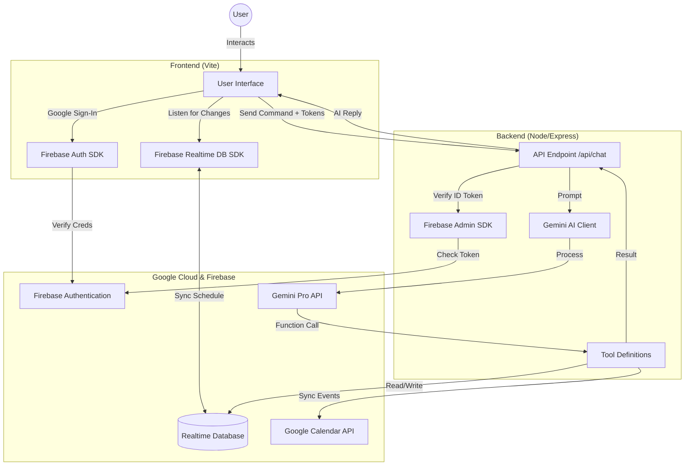

# To-Do Timeline App with AI & Google Calendar Integration

A smart daily planner application that uses AI to manage your schedule, syncs with Google Calendar, and persists data using Firebase Realtime Database.

## Architecture

## Features

-   **Timeline Visualization**: Horizontal scrolling timeline for daily activities.
-   **AI Assistant**: Chat with Gemini to add, update, or remove events using natural language (e.g., "Schedule lunch at 12pm").
-   **Google Calendar Sync**: Events added via the app appear in your Google Calendar and vice versa.
-   **Realtime Updates**: Changes reflect instantly across devices using Firebase.
-   **Secure Authentication**: Google Sign-In via Firebase Auth.

## Setup Instructions

### Prerequisites
- Node.js installed
- Google Cloud Project with Calendar API enabled
- Firebase Project with Auth & Realtime Database enabled

### Live Deployment
The backend is deployed on Render: [https://to-do-iun8.onrender.com](https://to-do-iun8.onrender.com)
The frontend is configured to point to this URL in `frontend/script.js`.

### Installation & Local Development

1.  **Clone the repository**
2.  **Using Yarn**:
    The project is configured to use **Yarn**. 
    - In `backend/`: Run `yarn install` and `yarn start`.
    - In `frontend/`: Run `yarn install` and `yarn dev`.

3.  **Environment Variables**:
    - **Backend**: Create `.env` with `GEMINI_API_KEY`. Render uses "Secret Files" for `serviceAccountKey.json`.
    - **Frontend**: Configure `firebaseConfig` in `script.js`.
