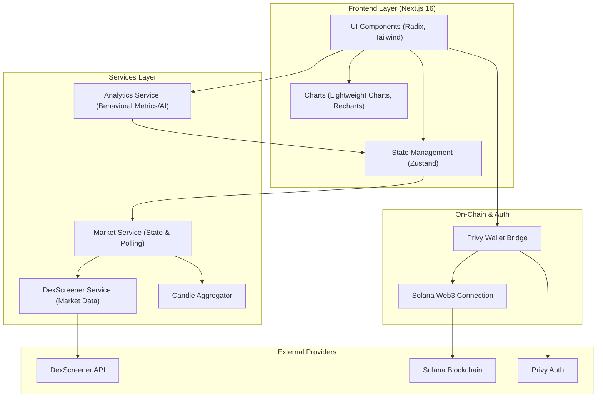

# Dominus Quant (DQuant)

Dominus Quant is a narrative-driven, AI-assisted crypto trading platform designed for real-time market insight and optional automated spot execution. Built as a personal project, it’s a proof-of-concept for **next-generation quant infrastructure**, combining behavioral analytics, distributed intelligence, and portfolio storytelling.

This project demonstrates what’s possible when **trading intelligence, narrative detection, and modular infrastructure** meet. It’s ready for scale, edge computing integration, and community-driven execution.

---

## Why DQuant Matters

Markets move on **narratives**, not just price.  
Dominus Quant tracks:

- **Ecosystem signals** – tweets, hackathons, announcements, social activity  
- **Market microstructure** – order flow, liquidity shifts, volume surges  
- **Behavioral patterns** – trading psychology, FOMO, and performance decay  

By combining these layers, DQuant gives both manual traders **actionable insight** and automated pool participants a **safe, risk-managed execution engine**.

---

## Core Product Features

### 1. Hybrid Trading Platform
- **Manual Mode:** Traders receive signals and confidence scores, but retain full control  
- **Automated Pool Mode:** Users allocate capital, press “play,” and trades are executed via the Dominus Engine with risk limits  

### 2. Narrative Portfolio Analytics
- Converts raw trade data into **story-driven insights**  
- Highlights patterns, peak focus periods, and mistakes  
- AI-driven recommendations prevent self-sabotage and improve discipline  

### 3. Deep AI Insights
- Behavioral risk analytics: execution timing, revenge trades, overtrading  
- Performance decay detection and adaptive guidance  
- Probabilistic trade confidence scoring  

### 4. Trading Journal & Dashboard
- Automatic indexing of trades with metadata: pair, date, PnL, strategy notes  
- Visual replay of trades with structured insights  
- Key metrics: PnL, win rate, long/short bias, best session, largest gain/loss  

---

## System Architecture

- **Frontend:** Next.js 16, Tailwind CSS, Zustand  
- **Analytics & Charts:** Lightweight Charts (trade playback), Recharts (portfolio visualizations)  
- **Backend & On-Chain:** Solana Web3.js, custom Deriverse indexer, optional capital pool contracts  
- **AI Layer:** Real-time behavioral signal analysis  
- **Distributed Ready:** Modular design for edge-device contribution and signal aggregation  

This stack demonstrates **full-stack Web3 engineering**, from UI/UX to on-chain integration, distributed systems, and AI intelligence.

---

- **Strategically differentiated:** Leverages narrative momentum + market microstructure  
- **Modular and scalable:** Edge contribution and pool execution ready  

## Next Steps

- Expand distributed signal layer (edge nodes contribute intelligence)  
- Add multi-asset support across Solana, Monad, or other L1/L2  
- Integrate more AI-driven behavioral guidance and risk modeling  
- Turn automated pool mode into a **community-governed quant engine**
---
